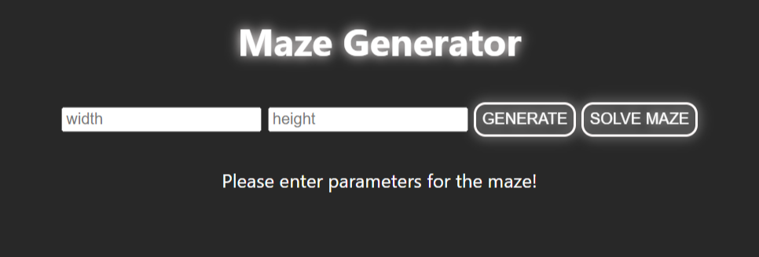
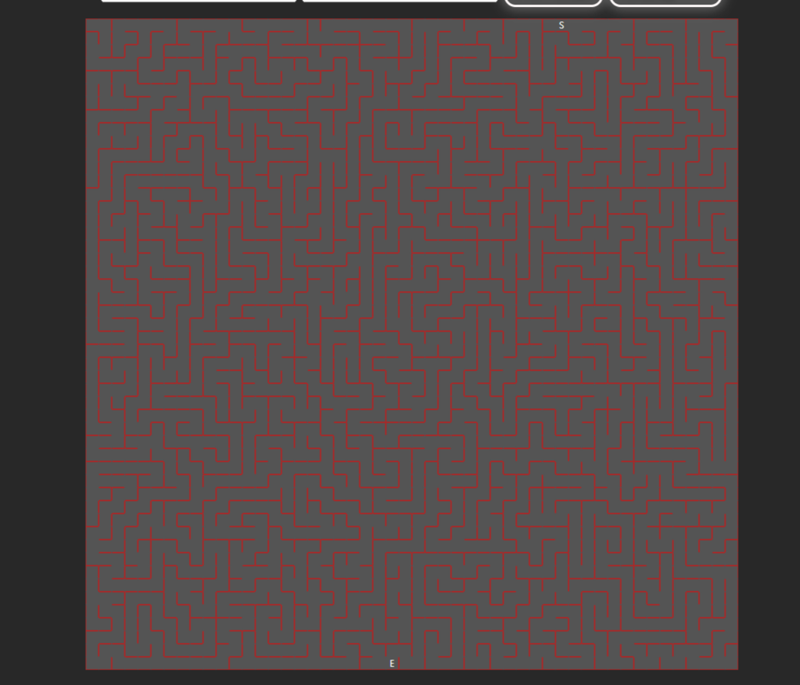

# Maze Generator and Solver

Welcome to the Maze Generator and Solver project, a fun and interactive maze generation and solving tool created using JavaScript and React. This project allows you to generate custom mazes, visualize them, and even find a solution using the A* algorithm.

## Features

- **Maze Generation:** Create custom mazes by specifying the width and height.
- **Interactive Visualization:** Visualize the generated mazes and explore them.
- **A * Algorithm Solver:** Let the computer solve the maze for you using the A* algorithm.

## Notice

There is no limit to maze size when seting parameters! It can try to generate insanely large mazes witch can break the webpage! Keep it in the range 10 - 100 for best results!

There is still room for improvement, this is something i eneded up creating in a day for practice. Maybe i will return to this to make it neat and a fun interactive maze game to publish on my [website.](https://vukmaric.rs)

The mobile devices have issues when viewing the page! Smaller screen means less viewing area and the maze navigation is harder!
Will try to enhance the mobile usage in the future.

## Usage

To use this project, follow these steps:

1. Clone the repository to your local machine:

    ```
    git clone https://github.com/VukMar/maze-generator.git
    ```

2. Open the project in your code editor and configure it as needed.

3. Run the project locally:

    ```
    npm install npm start
    ```

4. Open your web browser and navigate to `http://localhost:3000` to access the application.

5. Select the dimensions (width and height) for your maze.

7. Click the "Generate" button to create your maze.

8. Explore the maze interactively or click the "Solve Maze" button to let the computer solve it for you.

## Examples

 



## Contributing

Contributions are welcome! If you'd like to improve this project, feel free to fork the repository, make changes, and submit a pull request.

## License

This project is licensed under the [MIT License](LICENSE).

Enjoy exploring and solving mazes with the Maze Generator and Solver!

For any questions or issues, please contact [VukMar](https://github.com/VukMar).
